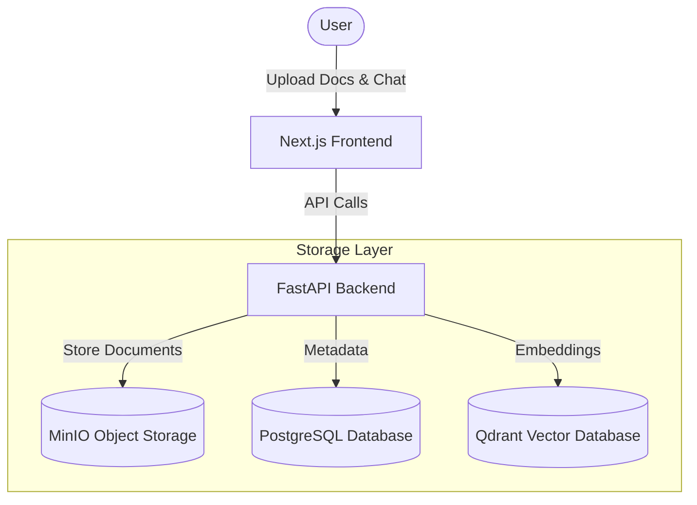
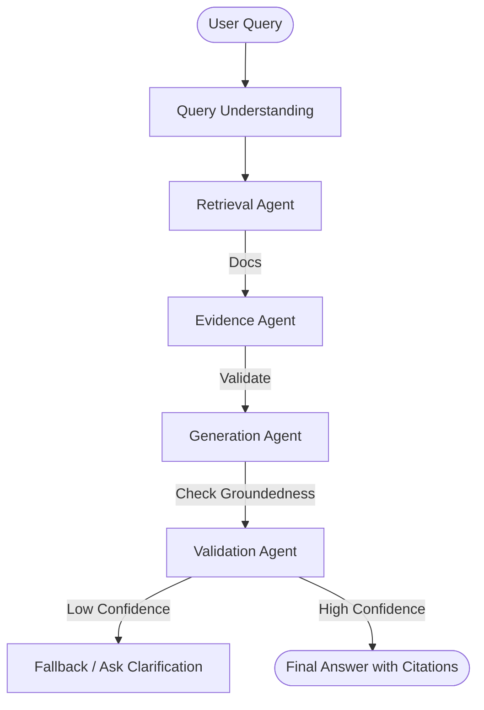
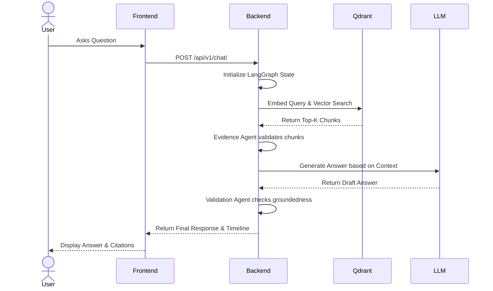

# QweryWise-AI

[](https://opensource.org/licenses/MIT)

**QweryWise-AI** is an Enterprise Self-Correcting RAG (Retrieval-Augmented Generation) Platform. Upload your enterprise documents, ask questions, and receive trustworthy answers backed by real evidence, confidence scores, and intelligent self-correction.

---

## 📌 Problem Statement
Enterprise users struggle to trust LLM answers because of hallucinations, lack of citations, and "confident but wrong" answers. Traditional RAG systems blindly retrieve information and generate answers without verifying the relevance of the retrieved data. QweryWise-AI solves this by using a multi-agent LangGraph workflow that self-corrects, validates groundedness, flags contradictions, and cites specific documents.

---

## ✨ Features
- **Self-Correcting RAG:** Agents detect contradictions and groundedness, automatically retrying if confidence is low.
- **Verifiable Evidence:** Every generated answer is backed by traceable sources.
- **Enterprise Format Support:** Processes PDF files seamlessly.
- **Confidence Scoring:** Validates the likelihood of a correct answer before serving it to the user.
- **FastAPI Backend:** High-performance, async backend API.
- **Next.js Frontend:** Modern, responsive, and accessible UI.

---

## 🏗️ Architecture

### System Architecture


### AI Workflow (LangGraph)


### Request Flow


---

## 💻 Tech Stack
- **Frontend:** Next.js, React, Tailwind CSS, shadcn/ui, Framer Motion
- **Backend:** FastAPI, Python, Pydantic, SQLAlchemy
- **AI / LLM:** LangChain, LangGraph, OpenAI (via Featherless API), Google Generative AI Embeddings
- **Storage:** PostgreSQL (Metadata), Qdrant (Vector DB), MinIO (Object Storage), Redis (Caching)
- **Deployment:** Docker, Docker Compose

---

## 📂 Folder Structure
```text
QweryWise-AI/
├── backend/
│   ├── app/
│   │   ├── agents/      # LangGraph workflows and agents
│   │   ├── api/         # FastAPI route handlers
│   │   ├── core/        # App configuration, logging, database setup
│   │   ├── models/      # SQLAlchemy ORM models
│   │   └── services/    # Business logic (MinIO, Qdrant, RAG processing)
│   ├── tests/           # Unit and integration tests
│   ├── main.py          # FastAPI application entry point
│   └── requirements.txt
├── frontend/
│   ├── src/
│   │   ├── app/         # Next.js app router pages
│   │   ├── components/  # Reusable UI components
│   │   ├── hooks/       # Custom React hooks
│   │   └── lib/         # API clients and utilities
│   ├── package.json
│   └── tailwind.config.js
└── docker-compose.yml   # Multi-container orchestration
```

---

## 🚀 Installation & Environment Setup

### Prerequisites
- Docker & Docker Compose
- Node.js 18+
- Python 3.10+ (if running locally outside Docker)

### 1. Clone the repository
```bash
git clone https://github.com/your-username/QweryWise-AI.git
cd QweryWise-AI
```

### 2. Environment Variables
Copy the `.env.example` file and configure your keys:
```bash
cp .env.example .env
```
Ensure you have API keys for LLM (OpenAI/Featherless) and Embeddings (Google).

### 3. Run with Docker Compose
To start the entire stack (PostgreSQL, Qdrant, MinIO, Redis):
```bash
docker-compose up -d
```

### 4. Run Backend Locally
```bash
cd backend
python -m venv venv
source venv/bin/activate  # On Windows: venv\Scripts\activate
pip install -r requirements.txt
uvicorn main:app --reload --port 8000
```

### 5. Run Frontend Locally
```bash
cd frontend
npm install
npm run dev
```
Access the application at `http://localhost:3000`.

---

## 📖 API Documentation
Once the backend is running, visit:
- **Swagger UI:** `http://localhost:8000/docs`
- **ReDoc:** `http://localhost:8000/redoc`

---

## 📸 Screenshots
*(Coming soon)*

---

## 🎥 Demo
*(Coming soon)*

---

## 🤝 Contribution Guide
Please refer to our [CONTRIBUTING.md](CONTRIBUTING.md) for details on our code of conduct, and the process for submitting pull requests.

---

## 📄 License
This project is licensed under the MIT License - see the [LICENSE](LICENSE) file for details.
